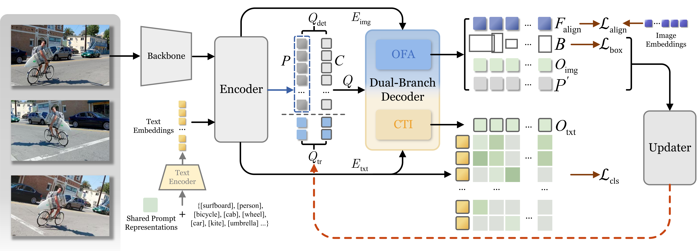

# OVTR: End-to-End Open-Vocabulary Multiple Object Tracking with Transformer


<p align="center"></p>

> **[ICLR 2025] OVTR: End-to-End Open-Vocabulary Multiple Object Tracking with Transformer**
> 
> Jinyang Li, En Yu, Sijia Chen, Wenbing Tao
> 
> *[openreview](https://openreview.net/forum?id=GDS5eN65QY)*

- We propose the first end-to-end open-vocabulary multi-object tracking algorithm, introducing a novel perspective to the OVMOT field, achieving faster inference speeds, and possessing strong scalability with potential for further improvement.
- We propose the category information propagation (CIP) strategy to enhance the stability of tracking and classification, along with the attention isolation strategies that ensure open-vocabulary perception and tracking operate in harmony.
- We propose a dual-branch decoder guided by an alignment mechanism, empowering the model with strong open-vocabulary perception and multimodal interaction capabilities while eliminating the need for time-consuming preprocessing.

<p align="center"></p>

## 💡 News
* We release the code, scripts and checkpoints on TAO
* Our paper is accepted by ICLR 2025!

## 🌞 Main results

### Open-Vocabulary Multiple Object Tracking on the TAO validation set
| **Method** | Data  |  Embeds  | ${\text{Prop}}_{\text{novel}}$ | **FPS**  | TETA↑(novel)  | AssocA↑(novel) | ClsA↑(novel) | TETA↑(base)   | AssocA↑(base) | ClsA↑(base)    |
| -- | -- | -- | -- | -- | -- | -- | -- | -- | -- | -- |
| OVTrack                 | G-LVIS,LVIS | 99.4M | ✓   | 3.1            | 27.8           | 33.6           | 1.5           | 35.5           | 36.9           | **20.2** |
| **OVTR** [[weights]](https://drive.google.com/drive/folders/1Ta_duIe_SZx_MXuyUIBu8BZWV8dnXRqi?usp=drive_link)                  | LVIS        | 1,732 |    | **3.4**        | **31.4**       | **34.5**       | **5.4**       | **36.6**       | **37.6**       | 20.1     |    
| **OVTR-Lite** [[weights]](https://drive.google.com/drive/folders/1Ta_duIe_SZx_MXuyUIBu8BZWV8dnXRqi?usp=drive_link)           | LVIS        | 1,732 |    | **12.4**       | **30.1**       | **34.4**       | **3.1**       | **35.6**       | **37.0**       | 18.6     |

### Open-Vocabulary Multiple Object Tracking on the TAO test set
| **Method** | Data  |  Embeds  | ${\text{Prop}}_{\text{novel}}$ | **FPS**  | TETA↑(novel)  | AssocA↑(novel) | ClsA↑(novel) | TETA↑(base)   | AssocA↑(base) | ClsA↑(base)    |
| -- | -- | -- | -- | -- | -- | -- | -- | -- | -- | -- |
| OVTrack                 | G-LVIS,LVIS | 99.4M | ✓   | 3.1           | 24.1           | 28.7            | 1.8           | 32.6           | 35.4           | **16.9** |
| **OVTR** [[weights]](https://drive.google.com/drive/folders/1Ta_duIe_SZx_MXuyUIBu8BZWV8dnXRqi?usp=drive_link)                  | LVIS        | 1,732 |    | **3.4**        | **27.1** | **32.1**  | **2.1** | **34.5** | **37.5** | 14.9       |

## 🔧 Installation

```shell
# create a virtual env
conda create -n OVTR python=3.9
# activate the env
conda activate OVTR

# install OVTR
git clone https://github.com/jinyanglii/OVTR.git
cd OVTR
conda install pytorch==1.10.1 torchvision==0.11.2 torchaudio==0.10.1 pytorch-cuda=11.1 -c pytorch -c nvidia
pip install -r requirements.txt
# Different installation versions may lead to changes in evaluation scores.

# create the model zoo folder
mkdir model_zoo
```

 - Compile the Deformable Attention CUDA ops:

```shell
# from https://github.com/fundamentalvision/Deformable-DETR
cd ovtr/models/ops/
sh make.sh
# You can test this ops if you need:
python test.py

# for the detection pretraining
cd ../../..
cd ovtr_det_bs2_pretrain/models/ops/
sh make.sh
python test.py
```


## 💽 Data

You should place the unzipped [LVIS](https://www.lvisdataset.org/) and [TAO](https://taodataset.org/) datasets into the `data/` directory. 

Obtain the filtered images [lvis_filtered_train_images.h5](https://drive.google.com/drive/folders/167IGC0Hkpnmpw7C95-AaPmWuVJZtC-q5?usp=drive_link) and the processed annotations [lvis_clear_75_60.json](https://drive.google.com/drive/folders/167IGC0Hkpnmpw7C95-AaPmWuVJZtC-q5?usp=drive_link). The [TAO dataset annotations](https://drive.google.com/drive/folders/167IGC0Hkpnmpw7C95-AaPmWuVJZtC-q5?usp=drive_link) generated by [OVTrack](https://github.com/SysCV/ovtrack/blob/main/docs/GET_STARTED.md) are also required.

You can also use [lvis_filter.ipynb](./process/lvis_filter.ipynb) to customize the annotation processing and generate `lvis_clear_75_60.json`. Before this, ensure [lvis_image_v1.json](https://drive.google.com/drive/folders/167IGC0Hkpnmpw7C95-AaPmWuVJZtC-q5?usp=drive_link) (which combines LVIS and COCO annotations) is prepared beforehand.

Finally, you should get the following structure of Dataset and Annotations:

```
data/
  ├── Lvis_v1/
  │ ├── train2017/
  │ ├── (val2017/)
  │ └──  annotations/
  │   └── lvis_v1_train.json
  ├── lvis_filtered_train_images.h5 # Filter out images that only contain rare category targets
  ├── TAO/
  │ ├── val/
  │ └──  test/
  ├── lvis_image_v1.json
  ├── lvis_clear_75_60.json
  ├── lvis_classes_v1.txt
  ├── validation_ours_v1.json # From OVTrack
  └── tao_test_burst_v1.json
 ```


## Training
First, place [ovtr_det_pretrain.pth](https://drive.google.com/drive/folders/1Ta_duIe_SZx_MXuyUIBu8BZWV8dnXRqi?usp=drive_link) in the `model_zoo/` folder.

Additionally, prepare the [Clip text embeddings](https://drive.google.com/drive/folders/1Ta_duIe_SZx_MXuyUIBu8BZWV8dnXRqi?usp=drive_link) and [Clip image embeddings](https://drive.google.com/drive/folders/1Ta_duIe_SZx_MXuyUIBu8BZWV8dnXRqi?usp=drive_link) in the `model_zoo/` folder. The prompts for `Clip text embeddings` come from [DetPro](https://github.com/dyabel/detpro).

You can also generate the `Clip image embeddings` yourself by using [gen_clip_image_embeds.py](./process/gen_clip_image_embeds.py) for the preprocessing.

 - **Train a complete OVTR**
```shell
cd ovtr/
sh tools/ovtr_multi_frame_train.sh
```

 - **Train Lite version (recommended)**
```shell
cd ovtr/
sh tools/ovtr_multi_frame_lite_train.sh
```

### Detection Pre-training
You can also choose to pre-train the detection perception part from scratch:

Obtain the [DINO dual-branch weights](https://drive.google.com/drive/folders/1Ta_duIe_SZx_MXuyUIBu8BZWV8dnXRqi?usp=drive_link) (by using [modify_dino_weight.py](./process/modify_dino_weight.py) to convert `dino_ep33_4scale.pth` from [DINO](https://github.com/IDEA-Research/DINO) for compatibility with the dual-branch structure).

```shell
cd ovtr_det_bs2_pretrain/
sh tools/ovtr_detection_pretrain.sh
```

## Evaluation

Place the weights [ovtr_5_frame.pth](https://drive.google.com/drive/folders/1Ta_duIe_SZx_MXuyUIBu8BZWV8dnXRqi?usp=drive_link) and [ovtr_lite.pth](https://drive.google.com/drive/folders/1Ta_duIe_SZx_MXuyUIBu8BZWV8dnXRqi?usp=drive_link) in the `model_zoo/` folder.

### Evaluate the performance of OVTR in open-vocabulary multi-object tracking (OVMOT).
 - **Evaluate OVTR on the TAO validation set using the TETA metric.**
```shell
cd ovtr/
sh tools/ovtr_ovmot_eval_e15_val.sh
```
 - **Evaluate OVTR on the TAO test set using the TETA metric.**
```shell
cd ovtr/
sh tools/ovtr_ovmot_eval_e15_test.sh
```
 - **Evaluate OVTR-Lite on the TAO validation set using the TETA metric.**
```shell
cd ovtr/
sh tools/ovtr_ovmot_eval_lite_val.sh
```
 - **Evaluate OVTR-Lite on the TAO test set using the TETA metric.**
```shell
cd ovtr/
sh tools/ovtr_ovmot_eval_lite_test.sh
```

## 🎬 Demo


 - **Run a demo of OVTR.**
```shell
cd ovtr/
sh tools/ovtr_demo.sh
```

## Citation
```bibtex
@inproceedings{liovtr,
  title={OVTR: End-to-End Open-Vocabulary Multiple Object Tracking with Transformer},
  author={Li, Jinyang and Yu, En and Chen, Sijia and Tao, Wenbing},
  booktitle={The Thirteenth International Conference on Learning Representations}
}
```

## Acknowledgement

- [MOTR](https://github.com/megvii-research/MOTR)
- [OVTrack](https://github.com/SysCV/ovtrack)
- [GroundingDINO](https://github.com/IDEA-Research/GroundingDINO)
- [DetPro](https://github.com/dyabel/detpro)
- [DINO](https://github.com/IDEA-Research/DINO)
- [TETA](https://github.com/SysCV/tet)


